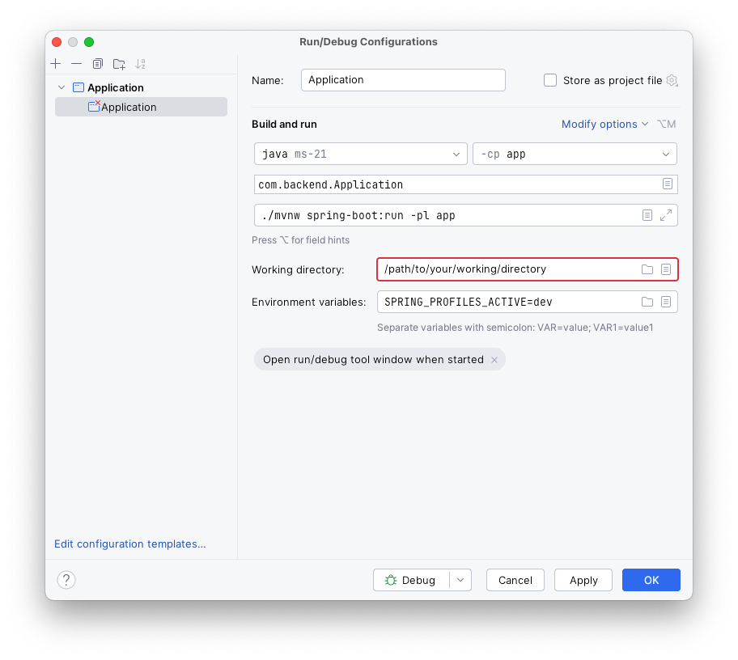

# Its my multi-module maven sample project.

### Prerequisite

1. Make sure your computer has JDK 21 already installed.

2. Clone this repository:

```shell
git clone --recursive git@github.com:hy-rf/multimodule-mavenproject.git
```

### How to run

1. Fill your config files in `app` module.

2. Build with maven:

```shell
./mvnw clean install
```

3. Find your jar file and run.

```shell
java -jar app/target/app-version.jar
```

or dev server:

```shell
./mvnw spring-boot:run -pl app
```

4. API service is now at port 8080.

5. You can move jar file to anywhere as standalone runnable jar file.

6. How to debug on IDEA
   

### Test

1. Run test command:

```shell
./mvnw clean test
```

### Deploy

[Link Text](docs/nginx.conf)